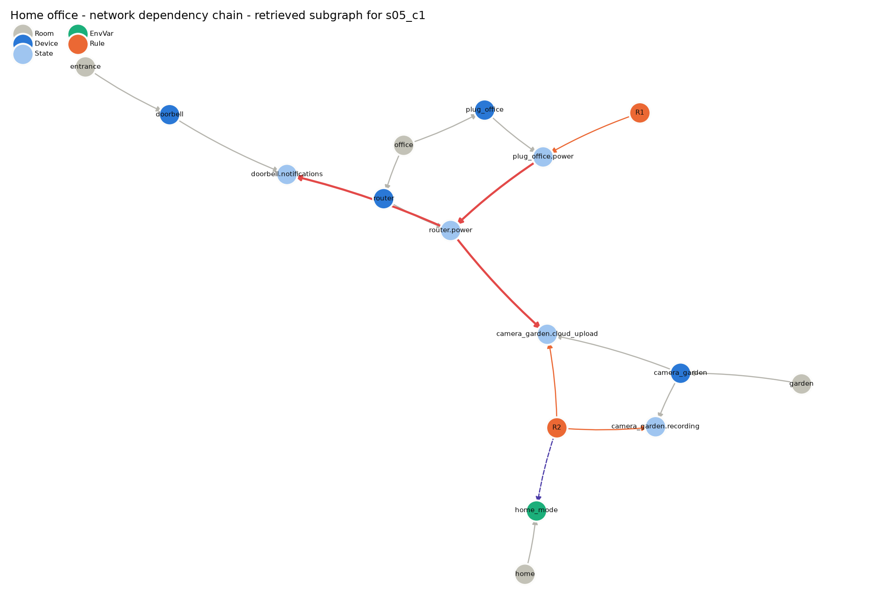

# Graph schema

Each home becomes one directed multigraph (`networkx.MultiDiGraph`) built by `shgrag/graph_builder.py`.

## Nodes

| Type | Id format | Attributes |
|---|---|---|
| Room | `room:<room>` | `name` |
| Device | `device:<device_id>` | `device_type`, `description` (describes the device itself, never its dependencies) |
| State | `state:<device_id>.<attribute>` | `device`, `values` (allowed values; empty = numeric) |
| EnvVar | `env:<env_id>` | `kind` (numeric / boolean / categorical), `values`, `description` |
| Rule | `rule:<rule_id>` | `text`, `trigger_time`, `time_ranges` |

Environment variables cover physical quantities (temperature, humidity, lux, CO₂, sound level), sensor events (motion, smoke, leak, rain) and context (home mode, geofence).

## Edges

| Edge | From → To | Attributes | Source in YAML |
|---|---|---|---|
| `HAS_DEVICE` | Room → Device | | `devices[].room` |
| `HAS_STATE` | Device → State | | `devices[].states` |
| `HAS_ENV` | Room → EnvVar | | `environment[].room` |
| `TRIGGERED_BY` | Rule → State/EnvVar | `op`, `value` | `rules[].trigger` (time triggers are a node attribute) |
| `CONDITIONED_ON` | Rule → State/EnvVar | `op`, `value` | `rules[].conditions` (time ranges are a node attribute) |
| `TARGETS` | Rule → State | `value` | `rules[].actions` |
| `AFFECTS` | State → State/EnvVar | `when`, `effect` (set/increase/decrease), `value`, `kind` (physical/environmental), `description` | `effects[]` |

`AFFECTS` edges hold knowledge that cannot be read from rule text:
- **physical** dependencies: power, network and water supply (plug → camera, router → doorbell);
- **environmental** effects: heater → temperature, vacuum → motion sensor.

The ablation (`include_effects=False`) removes exactly these edges.

## Retrieval

For a candidate rule set, `retriever.retrieve` collects:
1. the rule nodes and their TRIGGERED_BY / CONDITIONED_ON / TARGETS neighbours;
2. **causal chains**: from each TARGETS state, forward along AFFECTS (max 3 hops). An edge is followed only if its `when` matches the value produced by the previous step. For example, `plug=on` does not pull in effects that happen when `plug=off`;
3. the owning device of each state (with sibling states) and the room;
4. **touch points**: where a chain from rule A reaches something rule B triggers on, is conditioned on, or targets. This includes another state of a device B controls.

The subgraph is serialised to compact text (see `python -m shgrag retrieve s05_c1`). Only AFFECTS edges on a retrieved chain are kept as evidence.

## Example (s05_c1)

```
R1: plug_office.power = off -> router.power set off -> camera_garden.cloud_upload set off
  reaches: camera_garden.cloud_upload is TARGETS of R2 (camera_garden.cloud_upload = on)
```


